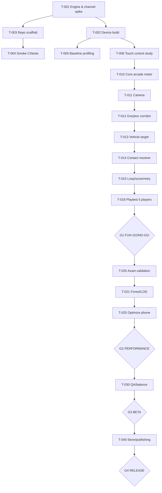

# Roadmap, Critical Path, Milestones, Capacity Model
Planning baseline 2026-10-08. This is **relative sequencing**, not a promise of elapsed dates.

## Work estimates and uncertainty
Estimates are **single-developer focused engineering hours**, excluding wait for app review, owner feedback, external QA scheduling, troubleshooting unknown hardware and graphics labor beyond noted asset integration. Add 30–50% contingency for a first engine/mobile project. Several tasks depend on purchasing/licenses and on-screen UX playtesting.

| Workstream | Typical effort range |
|---|---:|
| G0 toolchain / delivery feasibility | 20–40 h |
| G1 flight/impact core prototype | 45–85 h |
| G2 production forest, camera, polish/perf | 70–140 h |
| G3 beta, balance, UX, QA | 55–100 h |
| G4 release prep + compliance | 30–70 h |
| **Base engineering total** | **220–435 h** |
| **With 30–50% risk reserve** | **~286–653 h** |

Estimate *not* inclusive of full bespoke 3D asset production, complex soundtrack or hourly QA staffing. A primarily browser-based Three.js route needs a separate estimate after G0.

## Work package and gate map

## Stage G0 — Feasibility & technical risk retirement
**Aim:** we can actually open/test the game, and know the engine path.

Entry: empty repo + charter.  
Outputs: comparative ADR, pinned engine, phone/portrait hello world, build instructions, versioned lockfile, framerate baseline scene, control study notes.

**Evidence:** screenshot/video from iPhone or Android + compiled artifact / documented process, device/OS, recorded known browser incompatibilities, initial thermals and profiler logs.  
**Exit:** owner chooses **native-first** vs a proven link-playable alternative, with acceptable first-play access.

**No go:** unable to install/reach actual device / poor input latency that can't be fixed in bounded spike / major path incompatibility. Stop before buying assets.

## Stage G1 — Prototype (one fun loop)
Aim: believable feel with blocks and capsules, no art purchases.

Scope: drone motor, chase camera, 20–40s forest corridor (primitive trunks), one moving vehicle, correct collision, impact payoff, score, retry. Mobile portrait.

**Acceptance:**
- Direct touch action controls drone without tutorial screen, and is no harder than two primary gestures/buttons.
- One run can be completed start → hit/miss → retry on device.
- Distinguishable vehicle/obstacle collision at normal speed.
- Camera visibly tracks throughout; controls not under safe-area obstructions.
- 5 first-time players interviewed; at least 4/5 understand objective and request another run (investigate failures instead of immediately expanding).
- Dev + phone smoke tests and loop integration tests pass where available.

**No go:** low enjoyment, unclear target, frustrating input, failing collisions, thermal collapse. Iterate G1 in short bounded cycles; do not work on world scale.

## Stage G2 — Vertical slice
Aim: 1 polished forest route representing final art direction, nothing extraneous.

Outputs: optimized trees/road, 1–2 coherent stylized vehicles, silhouettes and traffic animation, camera occlusion fixes, coherent sonic identity, contact VFX, tutorial hint, accessibility settings, performance presets.

**Acceptance:**
- Reference low/mid device 30 fps stable under agreed thermal window; higher-end 60 fps when feasible.
- p95 CPU/GPU ≤ chosen tier frame budget after warm-up, worst spikes explained.
- Target and road visible through chosen sightlines; UI never occludes important gameplay.
- Pass ≥2 phone aspect ratios / safe-area classes; app resumes after interruption and offline.
- Evidence stored in issue/PR with screenshots, profiler logs, sample device.
- Owner greenlights art direction, flight feel, impact payoff.

## Stage G3 — Beta
Aim: create varied **curated** encounters with repeat value, not feature creep.

Outputs: 2–4 variants of routes/challenge, onboarding 1st launch, checkpoints/score tuning, accessibility, optimization, regression tests, 15–30 tester rounds, quality-of-life and build stability.

**Acceptance:** no open P0/P1; no common unjustified misses; majority testers can consistently complete a route without instructions after trying; documented retention intent, performance across device matrix. All rights of packaged assets documented.

## Stage G4 — Release candidate and distribution
Aim: compliant, signed owner-approved build.

Outputs: final art/audio, privacy facts, licenses, store listing, screenshots (actual app), age/content declaration, crash triage plan, testing distribution, rollback plan.

**Acceptance:** signed builds validated on device and in beta platform; store compliance reviewed; owner explicitly approves release. No automatic production publication.

## Sprint/cadence option (weekly, capacity-adjustable)
A sprint contains **one vertically integrated experience improvement**, not dozens of disconnected assets.
- Weekly start: choose max 2–4 unblocked issues by capacity and critical path.
- Daily AI-agent session: inspect AGENTS / NEXT_ACTION / assigned issues, implement scoped change, run tests, update handoff.
- Weekly demo: 30s gameplay video from *actual* target platform if available; decide keep/tune/revert.
- Weekly risk review: top 5 risks, decisions pending, estimated remaining effort, no unverifiable percent-complete claims.
- Gate reviews: short owner decision + evidence links.

## Critical path
Availability of target phone/build toolchain → engine choice → input/motor → camera → encounter & collision → fun test → forest scene → performance → beta QA → release. Delays on this path delay readiness. Texture shopping, soundtrack and menu aesthetics should NOT block initial fun loop.

## Parallelism
After T-003, visual references/license catalog and UX tests can run in parallel with core coding **but must not lock the engine** prematurely. Following G1, environment/audio/UI tracks may parallelize with constrained integration commits. A solo operator should WIP-limit to **2 concurrent active tasks**.

## Progress dashboard (truthful)
Track:
- `Gate`: G0/G1/G2/G3/G4
- `Playable`: NO / desktop editor / Android device / iOS device / web link
- `Frame evidence`: pending / tested device-specific
- `Controls`: untested / selected by user tests
- `Blockers`: URL of open P0 issues
- `Backlog`: GitHub issue state, no manually invented completion percentages

## Change triggers
If web URL test fails, choose native path (or re-scope 3D complexity); if drone control test fails, try control B; if forest overdraw kills performance, favor low-poly palette and opaque billboards; if purchased controller integration risk is high, replace with small custom arcadey motor.
